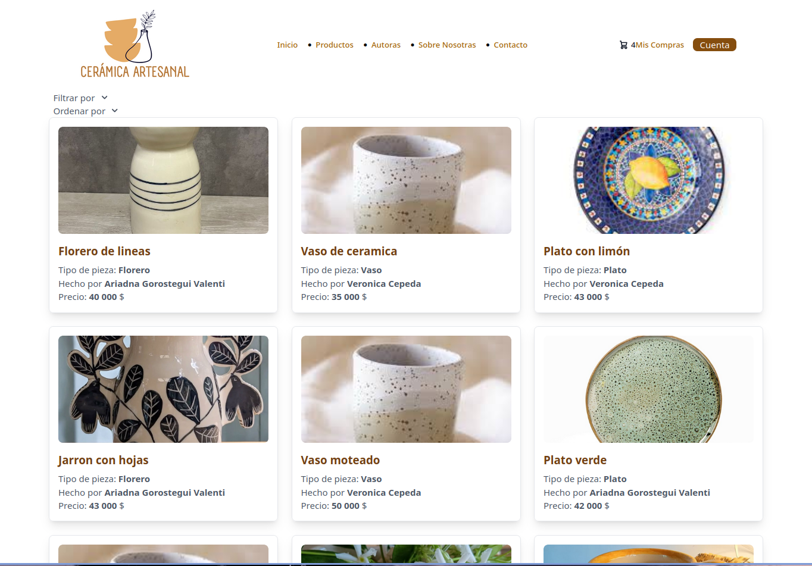

# Ceramic Artisan E-Commerce Platform

  
*An elegant and functional eCommerce platform for ceramic artisans.*

---

## Overview

The **Ceramic Artisan E-Commerce Platform** is a modern, fully functional online store designed for ceramic artists and small businesses. Built with **Django**, **Tailwind CSS**, and **Vanilla JavaScript**, this platform provides a seamless shopping experience, robust user authentication, product filtering, sorting, and a dual-cart system (local and user-based). So on the registration, the user can choose to make the local cart the user cart (which will be stored on the database) via a checkbox in the form. It is highly customizable and ready to be adapted to real-world brands.

This project is ideal for ceramic artists looking to showcase and sell their unique creations online. It is designed to be scalable, user-friendly, and visually appealing. I ([Daniel Penedo](https://dpenedo.com)), develped it for a customer and I use it as a template/showcase.

---

## Key Features

### 1. **User Authentication**

- **Secure Registration and Login**: Users can create accounts, log in, and manage their profiles.
- **Guest Checkout**: Users can shop without creating an account.
- **Cart Migration**: Local cart items can be transferred to a user account upon registration.

### 2. **Product Management**

- **Product Listings**: Display products with high-quality images, descriptions, and pricing.
- **Filtering and Sorting**: Users can filter products by category, price range, and other attributes. Sorting by price, popularity, and date added is also supported.
- **Product Details**: Detailed product pages with additional images, descriptions, and availability.

### 3. **Shopping Cart**

- **Dual Cart System**:
  - **Local Cart**: Stores items in the browser for guest users.
  - **User Cart**: Saves items to the database for logged-in users.
- **Cart Migration**: Seamless transfer of items from the local cart to the user cart during registration or login.

### 4. **Responsive Design**

- Built with **Tailwind CSS**, the platform is fully responsive and optimized for all devices (desktop, tablet, and mobile).

### 5. **Admin Panel**

- **Django Admin Interface**: Easily manage products, categories, orders, and users.
- **Customizable**: Add or modify fields as needed for specific business requirements.

### 6. **Search Functionality**

- Users can search for products by name, category, or keywords.

### 7. **Order Management**

- Users can view their order history and track the status of their orders.
- Admins can manage orders, update statuses, and generate invoices.

### 8. **Customizable Design**

- The platform is designed to be easily rebranded. Colors, logos, and styles can be adapted to match the client's brand identity.

---

## Technologies Used

### Backend

- **Django**: A high-level Python web framework for rapid development and clean design.
- **Django Tailwind**: Integration of Tailwind CSS for modern, responsive design.
- **Django Allauth**: For user authentication and account management.

### Frontend

- **Tailwind CSS**: A utility-first CSS framework for building custom designs.
- **Vanilla JavaScript**: Lightweight and fast JavaScript for interactive features.
- **HTML5**: Semantic markup for better SEO and accessibility.
- **crispy-forms**: [Crispy-forms](https://github.com/django-crispy-forms/django-crispy-forms) for forms, with the [Tailwind-crispy-forms](https://github.com/django-crispy-forms/django-crispy-forms) implementation.

--

## Functional Requirements

### User Roles

1. **Guest User**:
   - Browse products.
   - Add items to the local cart.
   - Checkout as a guest.
   - View and delete products of the local cart

2. **Registered User**:
   - Log in and manage profile.
   - Save items to the user cart.
   - View and delete products of the user cart

 **Admin**:

- Manage products, categories, and inventory.
- View and manage user accounts.
- View and manage users shopping cart.

### Core Features

- User registration and authentication.
- Product browsing with filtering and sorting.
- Shopping cart functionality (local and user-based).
- Order placement and management.
- Responsive and customizable design.

---

## Installation and Setup

### Prerequisites

- Python 3.9+

### Steps

1. **Clone the Repository**:

   ```bash
   git clone https://github.com/dPenedo/ceramic-ecommerce
   cd ceramic-ecommerce

   ```

2. Set Up a Virtual Environment:

```bash
python -m venv venv
source venv/bin/activate  # On Windows: venv\Scripts\activate
```

3. Install Dependencies:

```bash
pip install -r requirements.txt
```

4. Run migrations:

```bash
python manage.py makemigrations
python manage.py migrate

5. Run it on a local server
```

```bash
python manage.py runserver
```

6. Access the Application:
Open your browser and navigate to <http://127.0.0.1:8000>.

7. **(Optional)** If you want to edit Tailwind CSS styles, you'll need to run the Tailwind development server. It's set up to automatically update the website on every change!

```bash
python manage.py tailwind start
```

## Screenshots

### Home Page

  
*Home Page with featured products.*

### Product Page

  
*Detailed product page with images and descriptions.*

### Cart Page

  
*Shopping cart with items and options.*
